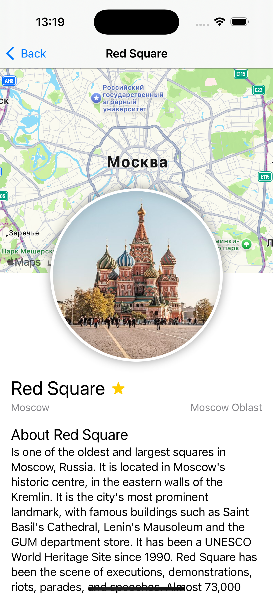
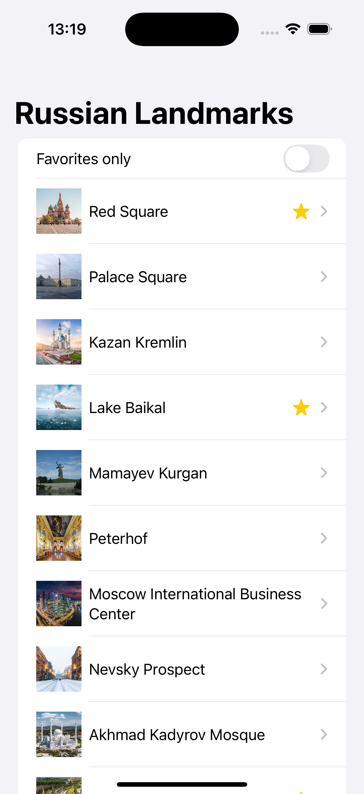
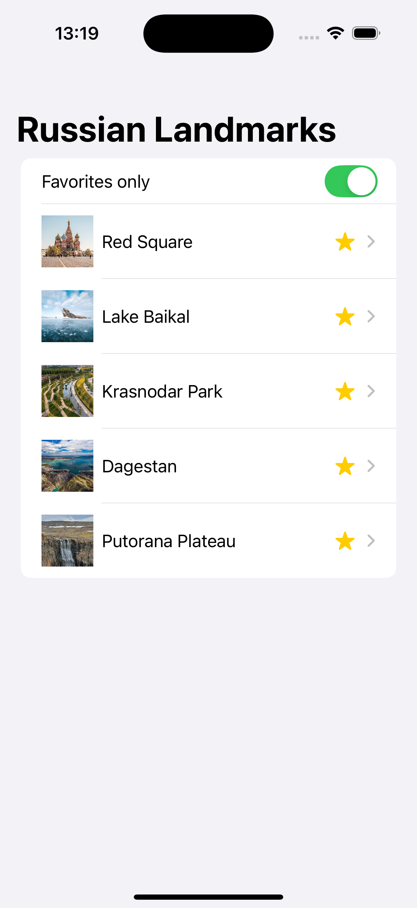
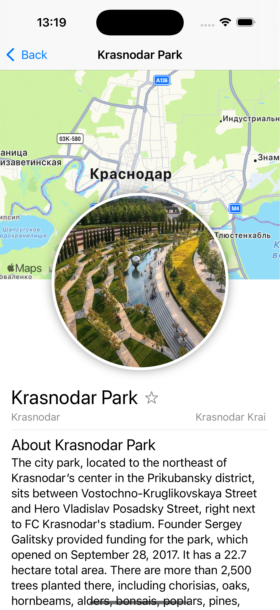

# Russian Landmarks

iOS app for russian landmarks. You can choose favorites landmarks and see landmarks detail.

# Installation

Clone or fork this repository:
```
git clone https://github.com/sergeypatrakov/RussianLandmarks
```

Open Xcode and RUN

# Preview

<p float="left">
  
   
  
  
</p>